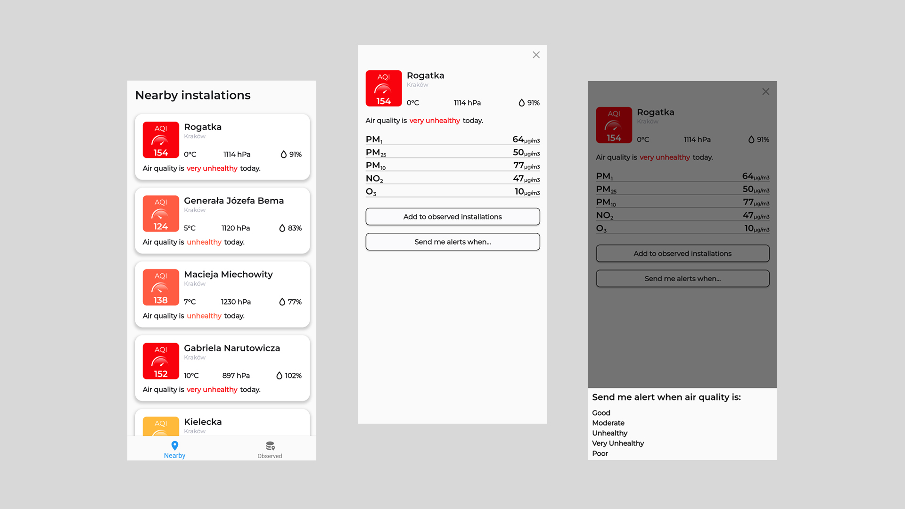

# airly_monitor


## About

An app that allows you to monitor the air quality around your device and set up an air quality exceedance alert that sends push notifications to warn you.

## Libraries used
- AutoRoute
- Bloc
- Freezed
- Injectable
- Retrofit

## Prerequirements
Before starting, run in main project folder:

`flutter pub run build_runner build`

Add `--dart-define` parameter to launch configuration

```
{
  "configurations": [
    ...
    {
      ...
      "toolArgs": [
        "--dart-define",
        "DEMO_TOKEN={your_token}",
      ]
    },
  ]
}
```

